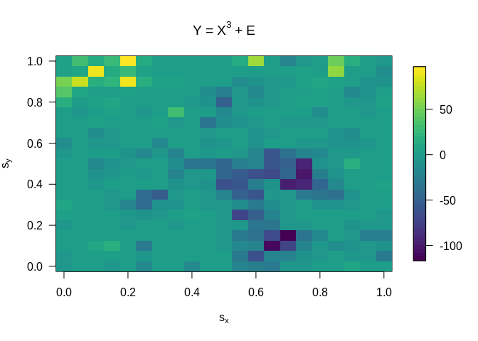

<!-- README.md is generated from README.Rmd. Please edit that file -->

# Spatial Conformal Prediction

<!-- badges: start -->

<!-- badges: end -->

The goal of scp is to provide spatial prediction intervals using Global
Spatial Conformal Prediction (GSCP) and Local Spatial Conformal
Prediction (LSCP).

## Installation

You can install the released version of scp from
[CRAN](https://CRAN.R-project.org) with:

``` r
install.packages("scp")
```

## Example

This is a basic example which shows you how to solve a common problem:

``` r
library(scp)

N = 21; n = N^2
S = seq(0,1,length=N)
s = expand.grid(S,S)
d = as.matrix(dist(s))

theta        = c(0,3,0.1,0.7)
names(theta) = c("Nugget","PartialSill","Range","Smoothness")
C = mat_cov(d,theta)
X = t(chol(C))%*%rnorm(n)
Y = X^3 + rnorm(n)

# Estimate spatial covariance parameters
bins     = seq(0.01,0.2,0.01)
thetaHat = get_theta(s,Y,dists=bins)

# spatial prediction
s0  = c(0.5, 0.5)
idx = which(s[,1]==s0[1] & s[,2]==s0[2])
PI  = conformal_pred(s0,s[-idx,],Y[-idx],thetaHat,eta=0.1)
cat(paste("True value: ", Y[idx], "\n"))
#> True value:  -7.25992225492578
cat(paste("Prediction Interval: [ ", PI[1], ",", PI[2], "]"))
#> Prediction Interval: [  -27.1715312222539 , 31.0846894011798 ]
```

A visualization of the spatial process:


